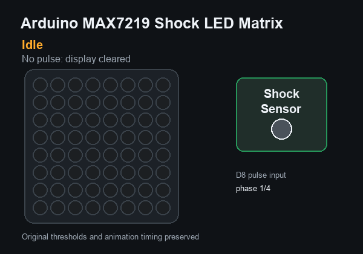
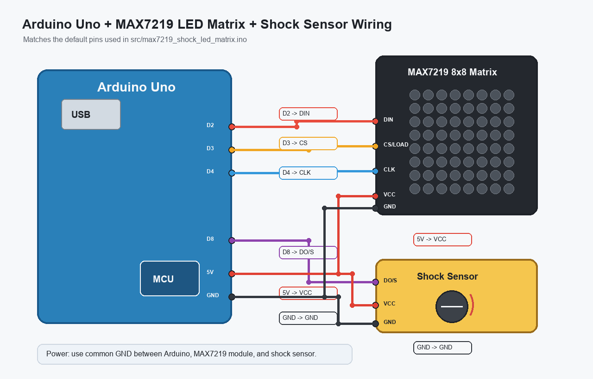

# Arduino MAX7219 Shock LED Matrix

Arduino Uno + MAX7219 LED Matrix animation project originally created in 2016. The project combines a vibration sensor with procedural LED animations generated on an 8x8 matrix.

This repository has been modernized for readability and GitHub presentation while preserving the original Arduino sketch behavior.



## Hardware

- Arduino Uno
- 8x8 LED matrix module with MAX7219 driver
- Vibration / shock sensor module with digital output
- Jumper wires
- USB cable or suitable Arduino power supply

## Pin Connections

| Arduino Uno | MAX7219 module |
| --- | --- |
| D2 | DIN |
| D3 | CS / LOAD |
| D4 | CLK |
| 5V | VCC |
| GND | GND |

| Arduino Uno | Shock sensor |
| --- | --- |
| D8 | DO / S |
| 5V | VCC |
| GND | GND |



## Library Dependency

Install the `LedControl` Arduino library before compiling:

1. Open Arduino IDE.
2. Go to **Tools > Manage Libraries...**.
3. Search for `LedControl`.
4. Install the LedControl library.

The sketch includes it as:

```cpp
#include <LedControl.h>
```

## Usage

1. Open [src/max7219_shock_led_matrix.ino](src/max7219_shock_led_matrix.ino) in Arduino IDE.
2. Select **Arduino Uno** as the board.
3. Select the correct serial port.
4. Upload the sketch.

The sketch keeps the original serial output at `9600` baud for shock pulse inspection.

## How It Works

The Arduino reads the shock sensor with `pulseIn()` on pin `D8`.

- No pulse: the matrix is cleared.
- Medium pulse: a procedural circle ring expands from a random center inside the middle area of the 8x8 matrix.
- Strong pulse: the original fixed 11-frame animation is played.

The procedural circle renderer tests whether the mathematical circle boundary intersects each LED cell. See [docs/algorithm.md](docs/algorithm.md) for the full explanation.

## Repository Structure

```text
.
├── README.md
├── LICENSE
├── images/
│   ├── demo.gif
│   └── wiring.png
├── src/
│   └── max7219_shock_led_matrix.ino
└── docs/
    └── algorithm.md
```

## History

Originally developed on October 1, 2016 as an Arduino learning project exploring procedural animation on an 8x8 MAX7219 LED matrix.

The repository has since been modernized while preserving the original implementation, thresholds, animation frames, and circle-rendering algorithm.

## Suggested GitHub Topics

```text
arduino
max7219
led-matrix
led-animation
embedded
embedded-cpp
arduino-uno
maker
electronics
```

## License

MIT License. See [LICENSE](LICENSE).
